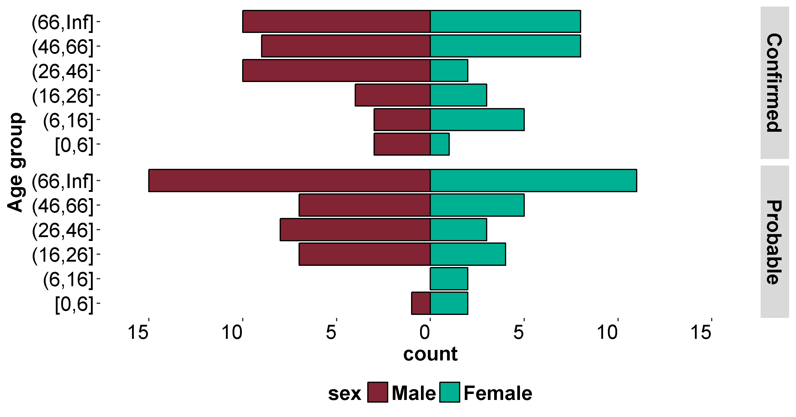
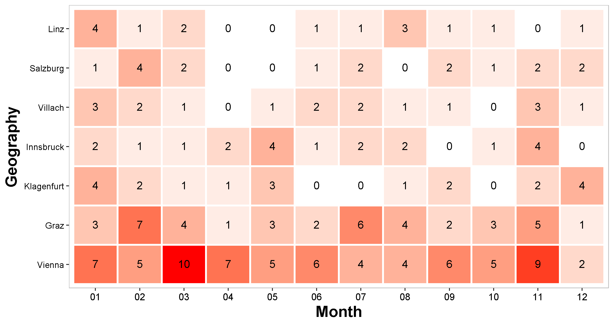

# EpiFunc


## Overview

EpiFunc is a collection of functions which output simple epidemilogical visualisations. 


## Installation

```{r, eval = FALSE}
# You can install EpiFunc using:

devtools::install_github("DanielGardiner/EpiFunc")

# If you have issues with permissions try using:

install.packages("httr")

httr::set_config(httr::config(ssl_verifypeer =0L))

devtools::install_github("DanielGardiner/EpiFunc")

```

## Examples 


```{r, eval = FALSE}

library(EpiFunc)

# set dummy data

set.seed(5)

data = data.frame(dates = sample(seq(as.Date('2014-01-01'), as.Date('2016-04-01'), by="day"), 200, replace = TRUE),
                  sex = sample(c("Male", "Female", "Unknown"), 200, replace = TRUE),
                  conf = sample(c("Confirmed", "Probable"), 200, replace = TRUE),
                  age = sample(c(NA, 1:100), 200, replace = TRUE),
                  geog = sample(c("Vienna", "Vienna", "Vienna", "Vienna",
                                  "Salzburg", "Innsbruck", "Graz", "Graz",
                                  "Linz", "Klagenfurt", "Villach"), 200, replace = TRUE))

data$age.grp = cut(as.numeric(data$age), breaks = c(0, 6, 16, 26, 46, 66, Inf),
                   include.lowest = TRUE)

data$month = format(data$dates, "%m")

# plot epicurve

epicurve(data, date.col = "dates", time.period = "month",
         fill.by="sex", split.by="conf", shade.by=NULL,
         start.at = "2014-01-01", stop.at = "2016-04-20",
         xlab="Month", ylab="Count",
         fill.by.legend.title = NULL, shade.by.legend.title = NULL, 
         angle=0, col.pal=7, label.breaks = 0, epi.squares = TRUE, 
         blank.background = TRUE, na.rm = TRUE) 

```


```{r, eval = FALSE}

age_sex_pyramid(data, age.grp.col = "age.grp", sex.col = "sex", 
                split.by = "conf", col.pal = "phe", 
                blank.background = TRUE)

```



```{r, eval = FALSE}

tile_plot(data, x.col = "month", y.col = "geog", text = TRUE, 
          x.lab = "Month", y.lab = "Geography", keep.row.order = FALSE)

```




